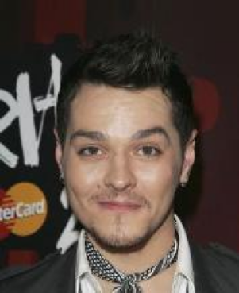
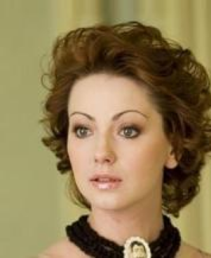
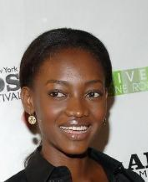
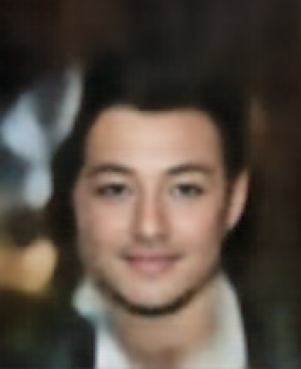
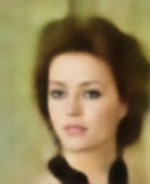
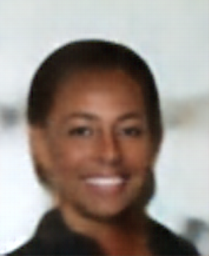

# Starting simple: Autoencoders

Autoencoders are a good place to start since they'll demonstrate why the idea of being able to sample from a distribution is important. The way they work is also pretty intuitive. Autoencoders learn low dimensional representations by passing data through a "bottleneck" and try to reconstruct it at the other end. 

## Defining a dataset

For this example we'll try and generate some faces from the famous [CelebA](https://mmlab.ie.cuhk.edu.hk/projects/CelebA.html) dataset. The dataset contains more than 200 thousand images of celebrities. The images have also been cropped so that faces are centred, which makes the machine learning task a bit easier.

::: {#fig-celeba layout-ncol=3}
{}

{}

{}

{}

{}

{}

Examples from CelebA validation set
:::

The dataset also comes with a set of attributes labels for each image for things like "Blond Hair" and "Eyeglasses". These will be useful when we want to explore the encoded representations of the images that we generate. 

## What is an autoencoder?

You can break down an autoencoder network into two parts, the encoder and decoder. 
It works by passing data through the encoder, which takes the input and squeezes it down to vector that is smaller in size. This is the low dimensional bottleneck. This vector is then input to the decoder which tries to reconstruct the input image. The model is trained by minimizing the difference (more on this later) between the input image and reconstructed image. In order for this to work The output of the encoder needs to contain enough information about the input data so that the decoder network can recreate it.

The encoder output can be considered a low(er) dimensional vector representation of the input data. They're often called latent or hidden vectors since they're supposed to contain the latent attributes of the data. For our purposes though the most interesting part is the decoder. If you train an autoencoder on a collection of images then you should be able to generate new images by passing simple, low dimensional data into the decoder input!

## Model structure and training

We can build the encoder and decoder layers using a series of convolutional (and transpose convolutional) layers. This is a common strategy for image based ML problems and, since there are other excellent resources describing how convolutional layers work, including the **link to pytorch docs**, I won't discuss them here. All the code written for this example can be found **here**. In building the model for this example I took plenty of inspiration from **Ref to deep learning book and the repo**.

The nice thing is that we can abstract away most of the complexity when it comes to training. The model, with an input sample $x$ can be represented simply as
$$
\hat{x} = g(f(x))
$$
where $\hat{x}$ is the reconstructed sample and $g$ and $f$ are the decoder and encoder respectively. The latent vector $h$ is given by
$$
h = f(x).
$$
Finally, training the autoencoder means simply picking a loss function $L$ and minimising
$$
L(x, g(f(x))).
$$
All we need to do now is select a loss function. In this case $x$ is a tensor of RGB pixel intensities for each image. The values are scaled to be between 0 and 1. Using the mean squared error (MSE) between our reconstructed and original pixel values is a reasonable choice, forcing the model to try and get the correct pixel values.

:::{.callout-note}
Using MSE loss in image reconstruction tasks can make the model less sensitive to small amounts of gaussian blur around the target pixel values, which makes images look blurry. 
:::

Keeping things simple and training the model using the Adam optimiser for 10 epochs achieves reasonable results. Practically no time was spent fine tuning this model but it does pretty well. Training took about 30 minutes on a single GPU. Instead of plotting training loss curves it's more insightful to just plot the input and output images directly.

[comment]: # (  )
### Comparing inputs and outputs

A side by side comparison of input and output images of the autoencoder should give some sense of how well it's performing.

::: {#fig-aegen_in layout-ncol=3}
{}

{}

{}

Original images
:::

::: {#fig-aegen_out layout-ncol=3}
{}

{}

{}

Autoencoder output
:::

A side by side comparison shows that while a lot of detail is lost the reconstructed image does resemble the original. At the very least it does look like a human face! What's interesting is that it's not just blurry, some details are lot entirely. Things like jewellery and ties are lost completely. This likely because that information doesn't make it though the bottleneck since its less important than other facial characteristics. More importantly, it should now be possible to create new images. 

## Generating images

Generating images should be as easy as generating new latent vectors and throwing them into the decoder. In this case these are 200 dimensional vectors. How do we go about generating new latent vectors that correspond to new faces. VAEs have an answer to this question but for now we can just try and sample some random vectors what look somewhat like the latent vectors from our validation set. 
To do this first encode the validation set and look at the 200 distributions corresponding to each dimension of the latent vectors. 

:::{.callout-tip}
## The decoder
If there is interest I can make the pre-trained decoder available so that you can try an generate images with it yourself. 
:::

### Exploring the latent space

# VAEs to the rescue

some words 

### The reparametrisation trick

## Adding the V in VAE

Intuitively 

> I remember asking a researcher at my old job exactly why VAEs made the assumption that elements in the latent space were normally distributed and the response was "that's just the assumption of the model. At the time it did not help.

#### References

