Variational Autoencoders (VAEs) were introduced by [Kingma et al](https://arxiv.org/abs/1312.6114) as an efficient method to learn posterior distributions using gradient descent. The paper describes how neural networks can be used to efficiently create models that can generate complex data by sampling from simple, known distributions. For those who are new to generative modelling contrasting VAEs with autoencoders can help highlight the key ideas. 

# Starting simple with autoencoders

If you're familiar with building and training neural networks autoencoders are a good place to start. They'll demonstrate why the idea of being able to sample from a distribution is important and the way they work is also fairly intuitive. As we progress it will become clear why they're not suitable for generative modelling and we'll discuss the changes needed to bridge the gap. Autoencoders learn low dimensional representations by passing data through an information bottleneck and try to reconstruct it at the other end. While they're often used in representation learning  tasks their structure is fairly similar to that of a VAE. To begin we'll build one and try to use it to generate images of faces.


## Defining a dataset

For this example we'll try and generate some faces from the famous [CelebA](https://mmlab.ie.cuhk.edu.hk/projects/CelebA.html) dataset. The dataset contains more than 200 thousand images of celebrities. The images have also been cropped so that faces are centred, which makes the machine learning task a bit easier.

::: {#fig-celeba layout-ncol=3}
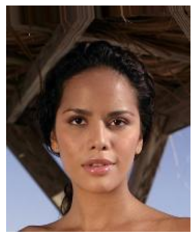{}

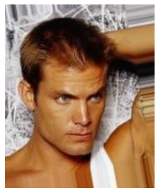{}

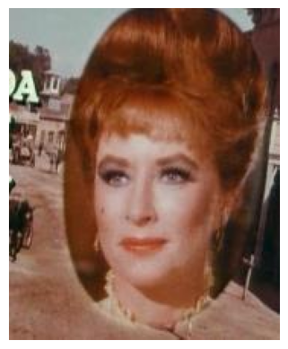{}

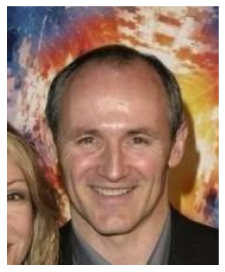{}

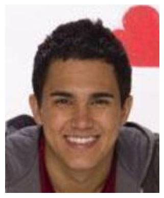{}

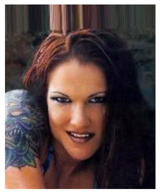{}

Examples from CelebA validation set
:::

The dataset also comes with a set of attributes labels for each image for things like "Blond Hair" and "Eyeglasses". These will be useful when we want to explore the encoded representations of the images that we generate. 

## What is an autoencoder?

You can break down an autoencoder network into two parts, the encoder and decoder. 
It works by passing data through the encoder, which takes the input and squeezes it down to vector that is smaller in size. This is the low dimensional bottleneck. This vector is then input to the decoder which tries to reconstruct the input image. The model is trained by minimizing the difference (more on this later) between the input image and reconstructed image. In order for this to work The output of the encoder needs to contain enough information about the input data so that the decoder network can recreate it.

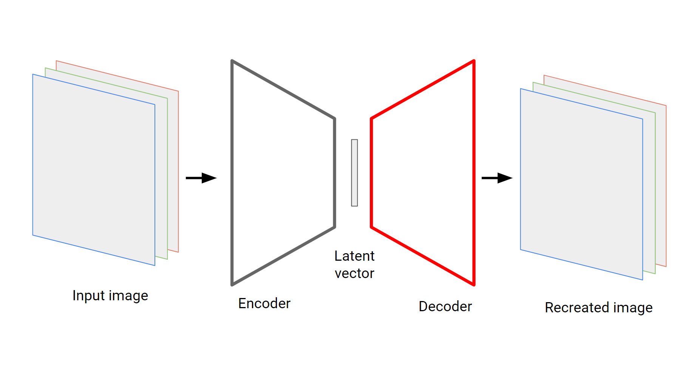

The encoder output can be considered a low(er) dimensional vector representation of the input data. They're often called latent or hidden vectors since they're supposed to contain the latent attributes of the data. For our purposes though the most interesting part is the decoder. If you train an autoencoder on a collection of images then you should be able to generate new images by passing simple, low dimensional data into the decoder input!


## Model structure and training

We can build the encoder and decoder layers using a series of convolutional (and transpose convolutional) layers. This is a common strategy for image based ML problems and, since there are other excellent resources describing how convolutional layers work, including the **link to pytorch docs**, I won't discuss them here. All the code written for this example can be found **here**. In building the model for this example I took plenty of inspiration from **Ref to deep learning book and the repo**.

The nice thing is that we can abstract away most of the complexity when it comes to training. The model, with an input sample $x$ can be represented simply as
$$
\hat{x} = g(f(x))
$$
where $\hat{x}$ is the reconstructed sample and $g$ and $f$ are the decoder and encoder respectively. The latent vector $h$ is given by
$$
h = f(x).
$$
Finally, training the autoencoder means simply picking a loss function $L$ and minimising
$$
L(x, g(f(x))).
$$
All we need to do now is select a loss function. In this case $x$ is a tensor of RGB pixel intensities for each image. The values are scaled to be between 0 and 1. Using the mean squared error (MSE) between our reconstructed and original pixel values is a reasonable choice, forcing the model to try and get the correct pixel values.

:::{.callout-note}
## Choice of loss function

Using MSE loss in image reconstruction tasks can make the model less sensitive to small amounts of gaussian blur around the target pixel values, which makes images look blurry. 
:::

Keeping things simple and training the model using the Adam optimiser for 10 epochs achieves reasonable results. Practically no time was spent fine tuning this model but it does pretty well. Training took about 30 minutes on a single GPU. Instead of plotting training loss curves it's more insightful to just plot the input and output images directly.

[comment]: # ( 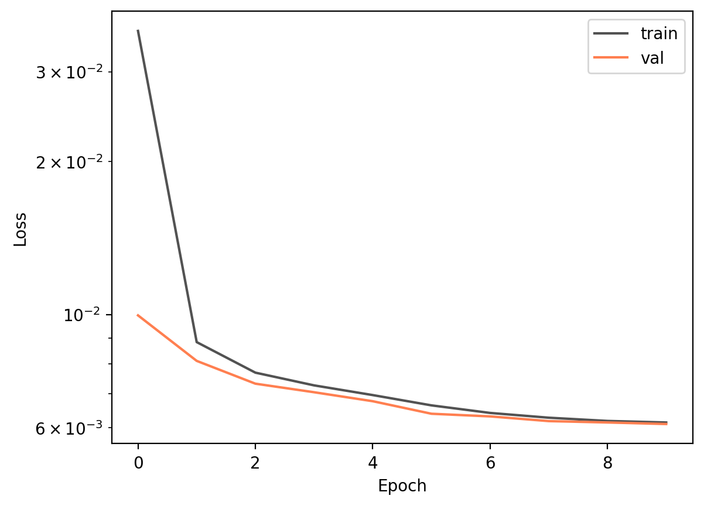 )
### Comparing inputs and outputs

A side by side comparison of input and output images of the autoencoder should give some sense of how well it's performing.

::: {#fig-aegen_in layout-ncol=3}
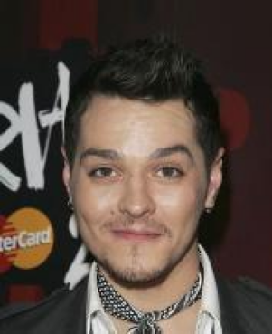{}

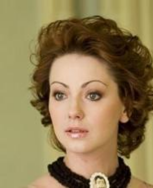{}

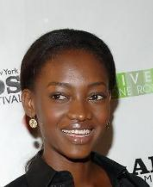{}

Original images
:::

::: {#fig-aegen_out layout-ncol=3}
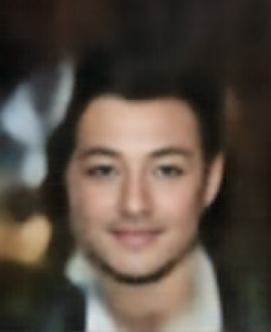{}

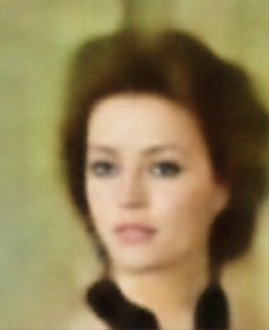{}

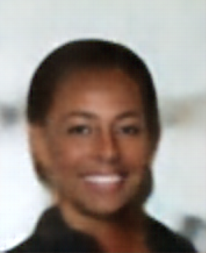{}

Autoencoder output
:::

A side by side comparison shows that while a lot of detail is lost the reconstructed images do resemble the originals. At the very least they look like human faces! What's interesting is that it's not just blurry, some of the fine details are lost. Subtle things like where the eyes are pointing and the asymmetry of a smile. Some things like jewellery and ties are lost completely. 
This happens because that information doesn't make it though the bottleneck, probably since it's less important than other facial characteristics when it comes to reconstructing pixel values. 
When information is missing the decoder just substitues it with something that "sort of works" for most training examples, or misses it entirely. Its definitely possible to do better at this stage but the decoder does seem to be able to generate faces. 

:::{.callout-tip}
## Making the models public
If there is interest I can make the pre-trained decoder available so that you can try an generate images with it yourself.
:::

## Generating (new) images

This is where things get tricky. It should be possible to generate new faces by creating new latent vectors and passing them through the decoder. What isn't clear however is how to generate the latent vectors. The problem of generating faces has now turned into the problem of generating latent vectors. This is the issue that VAEs address and is a good way to understand the underlying assumptions. 

Before we explore that however, we can see what happens if we try and make faces by taking an educated guess at what reasonable latent vectors look like. Remember, the goal is generate faces that are realistic and human looking, but distinct from those that are in the dataset. 
We can try and be clever and encode a set of images from the test set, take the mean and standard deviation values of the latent vectors generated and, in a bit of a hand-wavey attempt to generate vectors from the same distribution as the encoded sample, generate new vectors by sampling from a normal distribution with the same parameters.

::: {#fig-celeba layout-ncol=3}
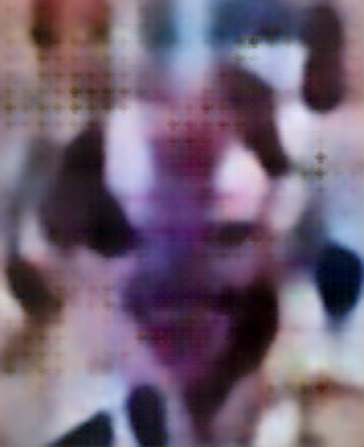{}

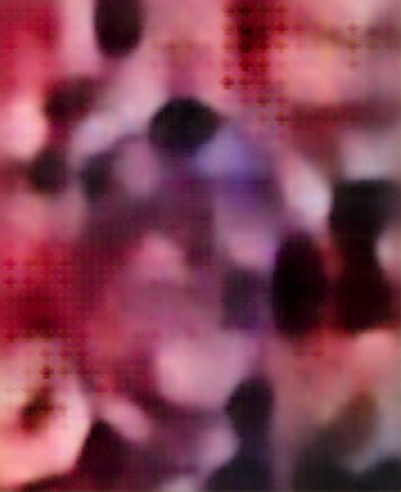{}

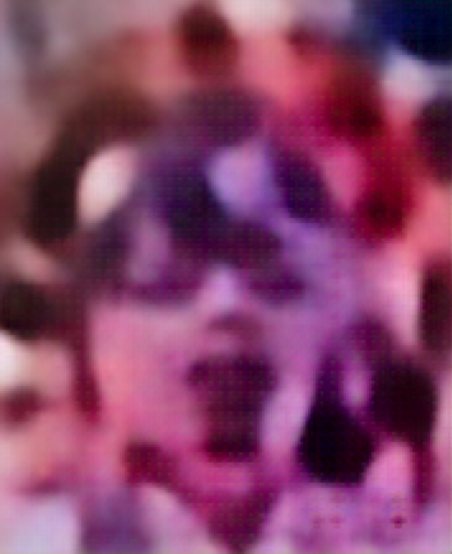{}

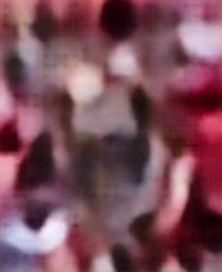{}

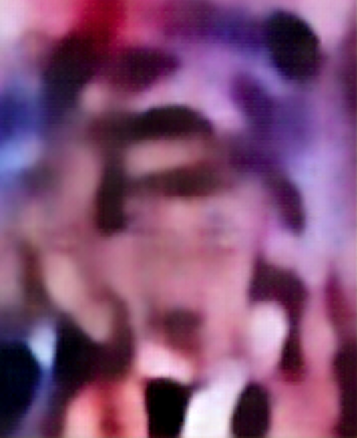{}

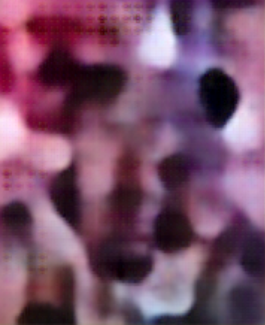{}

Passing random latent vectors through the decoder generates these images.
:::

 Turns out this doesn't work so well. If you squint at some of these image you can just about see a tortured face peering out from under the random blobs of colour, but nothing like the image that were generated above. This is the problem with using models like autoencoders to generate new data. There are no constraints on what values the latent vectors take, so when it comes to trying to generate new images you're stuck.

:::{.callout-note}
Going a step further and generating vectors by using the mean and standard deviation of each dimension independently generates slightly more realistic looking images, but similar problems are observed.
:::

# VAEs to the rescue

Now that you're convinced that just using autoencoders is insufficient we can explore the changes introduced by VAEs. Instead of mapping individual data points to points in latent space VAEs learn latent space distributions that are likely to generate realistic looking data. 

## Thinking in terms of distributions

Instead of optimising encoder and decoder functions consider a VAE as a latent variable model. VAEs address the problem of sampling the latent vectors directly by constraining them to be drawn from a known distribution, modelling the join probability of the latent variables $z$ and the data $x$. This is the equivalent of putting a prior on the $z$ vectors in a Bayesian framework. Typically we choose this distribution to be a isotropic multidimensional Gaussian, assuming no correlation between any of the dimensions of the latent vector:
$$
P(z) \sim \mathcal{N}(0, I).
$$
The choice of distribution is just an assumptions but has some useful properties that we'll see later. This change in modelling assumptions has a significant impact on how VAEs are trained and it becomes clear that they're actually only superficially similar to autoencoders.

:::{.callout-note collapse="true"}
## Why a Gaussian?

A natural question to ask is whether the choice of prior distribution constrains the model outputs in anyway. The good news is that it doesn't, any $d$ dimensional distribution can be generated by sampling $d$ variables from a normal distribution and transforming them with a sufficiently complex function. This is how inverse-transform sampling works, as discussed on [this page](index.qmd).
:::

We can write down the model as the join probability of the latent vectors and the data, $P(x, z)$. Using the chain rule of probability we can write this out in a way that better defines the generative process:
$$
P(x, z) = P(x | z)P(z)
$$
where the process is

1. Sample a latent vector $z \sim P(z)$
2. Generate a data point $x \sim P(x | z)$.

It is helpful to rewrite $P(x | z)$ as $P(x | z; \theta)$, where $\theta$ represents the parameters of the distribution $P_{x|z}$. What we want to optimise (maximise in this case), with respect to $\theta$, is the probability of each training example $x$ under the generative process
$$
\begin{aligned}
P(x) & = \int P(x | z; \theta)P(z) dz. \\
& = \mathbb{E}_{z \sim P(z)}P(x | z; \theta)
\end{aligned}
$$
We have already chosen how to define $P(z)$ but we still need to compute the integral over $z$. There are some key issues that make this quite difficult.


::: {.callout-tip}
## The Kullback–Leibler (KL) divergence

The KL divergence is defined as 
$$
\begin{aligned}
\mathcal{D}(P \parallel Q) &= \int p(x) \log \left( \frac{p(x)}{q(x)} \right) dx \\
&= \mathbb{E}_{p(x)} \left[ \frac{p(x)}{q(x)} \right]
\end{aligned}
$$
and is used as a measure to describe how one probability distribution differs from another.
:::

## What is a VAE?

In principle we can maximise $P(x)$ directly by sampling $n$ values of $z$ and then computing $P(x) \approx \frac{1}{n} \sum_i P(x | z_i; \theta)$. The problem here is just how many samples it would take. If you consider all the possible configurations of the pixels in the images $x$ its obvious that for the vast majority of the time $P(x|z; \theta)$ will be almost zero and sampling the corresponding $z$ values will not help improve our estimates of $P(x|z; \theta)$. This makes using traditional inference techniques such as Markov Chain Monte Carlo (MCMC) difficult, even before you consider the number of parameters. The discussion in [this](https://arxiv.org/abs/1606.05908) excellent introduction goes into more detail.

What makes VAEs more efficient is that during training we try and sample values of $z$ that are likely to produce $x$. This is done by introducing a new function $Q( z | x)$, which takes a value of $x$ and returns a distribution over $z$ values which are likely to produce $x$.
Where the generative model we've describe is analogous to the decoder part of the autoencoder this part is analogous to the encoder. 

:::{.callout-warning}
## Notation

There is a bit of notation overload here, which I have coped from [Doersch](https://arxiv.org/abs/1606.05908). I'm using P(...) to sometimes refer to generic probability distributions and sometimes specific functions. Hopefully with context its pretty clear in this example.
:::
Since we now sample $z \sim Q(z | x)$ our definition for $P(x)$ becomes
$$
\begin{aligned}
P(x) &= \int P(x | z; \theta)Q(z | x) dz \\
&= \mathbb{E}_{z \sim Q}P(x | z; \theta).
\end{aligned}
$$
Our goal is now to re-write this in terms of an expression which we can evaluate easily and therefore maximise. We do this by defining the ELBO (evidence lower bound) and showing that maximising the ELBO also maximises $P(x)$. (Or, $\ln P(x)$, since the logarithm is a monotonic function.)

### Deriving the ELBO

Starting from the definition of $P(x)$ and taking the natural logarithm,
\begin{aligned}
\ln P(x) &= \ln \left[  \mathbb{E}_{z \sim Q} P(x)\right] = \mathbb{E}_{z \sim Q} \ln  P(x)  &(P(x)~\text{is independent of}~z) \\

& =  \mathbb{E}_{z \sim Q} \left[ \ln \frac{P(x | z)P(z)}{P(z | x)} \right] & (\text{Bayes' rule}) \\

& = \mathbb{E}_{z \sim Q} \left[ \ln \frac{P(x | z)P(z)}{P(z | x)} \frac{Q(z | x)}{Q(z | x)} \right] & (\text{multiply by}~1) \\

& = \mathbb{E}_{z \sim Q} \ln P(x | z) 
- \mathbb{E}_{z \sim Q} \left[ \ln \frac{Q(z | x)}{P(z)} \right]  
+ \mathbb{E}_{z \sim Q} \left[ \ln \frac{Q(z | x)}{P(z | x)} \right] \\\\

\ln P(x) &= \mathbb{E}_{z \sim Q} \ln P(x | z) - \mathcal{D}(Q(z | x) \parallel P(z))
         + 
\underbrace{\mathcal{D}(Q(z | x) \parallel P(z | x))}_{\text{intractable},~\geq 0}. 
\end{aligned} 

It's possible to express the quantity we want to maximise in terms of several terms one of which is The KL divergence of $Q$ with an intractable term $P(z | x)$. The critical thing consider here is that the KL divergence of any two distributions is always $\geq 0$. This allows us to write

\begin{aligned}
\ln P(x) &\geq \underbrace{
    \underbrace{
        \mathbb{E}_{z \sim Q} \ln P(x | z)
        }_\text{reconstruction error} 
        - 
        \underbrace{
            \mathcal{D}(Q(z | x) \parallel P(z)).
        }_\text{fixes the latent}
}_\text{ELBO}
\end{aligned} 
The ELBO consists of two terms 

- One that represents the reconstruction error 
- The (negative) KL divergence between $Q$ and the desired distribution of $z$, $P(z)$. This adds a larger penalty for versions of $Q$ that generate $z$ distributions that deviate from $P(z)$.   

Since $P(z)$ is bound to be greater or equal to the ELBO, maximising the ELBO maximises the quantity that we care about. 

:::{.callout-tip collapse="true"}
## Alternate derivations

There are several methods to derive the ELBO. One method relies on Jensen's inequality while another starts with KL divergence between $Q(z|x)$ and the unknown distribution $P(z|x)$. The method I've chosen starts from the definition of $P(x)$ given above. 
:::
 
## Building and training VAE

Now that we've developed a theoretical understanding of that a VAE is, it should be possible to map the autoencoder architecture we've used already into one. The encoder does the job of $Q(z | x)$, mapping images to latent vectors. The main difference however is that the decoder should generate a distribution of $z$ given $x$ rather than a scalar vector. Assuming this distribution is a multivariate Gaussian, this can be done by modifying the decoder to output two vectors, one that represents the mean $\mu$ and one for (the log of) the variance $\sigma$. The decoder in turn represents $P(x | z).$ We could sample values probabilistically for the pixel densities but this isn't necessary in order to calculate the loss and typically isn't done.

### defining the loss function 

The first term of the loss function, based on the ELBO, represents the likelihood of generating the target image $x$ and can be interpreted as the reconstruction error. In the first example we used the MSE loss for our reconstruction error. Under the assumption that the pixel values are drawn from normal distributions the MSE loss can be interpreted as a likelihood, so that part can remain the same. Defining the second term can be defined relatively easily since we've fixed both $P(z)$ and $Q(z | x)$ to be a multivariate Guassians. The loss function then becomes


::: {.callout-caution collapse="true"}
## The $\beta$-VAE

blah
:::


#### The reparametrisation trick


% mention this after adding something about P(z|x)
It might be a good time to pause here before we discuss how we can optimise this and think about why this formulation helps us generate new data. During training 


Not only will be now be able to sample latent vectors from 


:::{.callout-tip collapse="true"}
## A PyTorch example

It's possible to make relatively small modifications to an autoencoder implemented in PyTorch and turn it into a VAE. 

```python
class VAE(AutoEncoder):
    """construct a VAE by using the basic same skeleton
    as the AutoEncoder, but by adding and overwriting a few things
    """

    def __init__(
        self,
        latent_dim,
        input_channels=3,
        encoder_channel_out_sizes=[16, 32, 64, 128, 256],
        input_image_h_w=(218, 178),
    ):
        super().__init__(
            latent_dim,
            input_channels,
            encoder_channel_out_sizes,
            input_image_h_w,
        )
        # Add another linear layer for the log variance
        self.encoder_linear_logvar = nn.Linear(self.linear_layer_size, self.latent_dim)

    @staticmethod
    def reparameterise(mu, logvar):
        """Implement the reparameterisation trick"""
        # scale the log variance to std
        std = torch.exp(0.5 * logvar)
        # sample from a standard noem
        normal_noise = torch.randn_like(std)
        return mu + (std * normal_noise)

    def encode(self, input: torch.Tensor):
        """Helper function making it easier to encode
        images
        """
        x = self.encoder(input)
        mu = self.encoder_linear_mean(x)
        logvar = self.encoder_linear_logvar(x)
        return self.reparameterise(mu, logvar), mu, logvar

    def forward(self, input):
        encoded, mu, logvar = self.encode(input)
        return self.decode(encoded), mu, logvar

    def loss_function(self, input, target, mu, logvar):
        # summed over each element in the latent space
        # the mean is taken over training examples
        kld_loss = torch.mean(
            -0.5 * torch.sum(1 + logvar - mu**2 - logvar.exp(), dim=1), dim=0
        )
        kld_loss = kld_loss * 1e-5

        reconstruction_loss = nn.functional.mse_loss(input, target)

        return (
            reconstruction_loss + kld_loss,
            reconstruction_loss.detach(),
            kld_loss.detach(),
        )
```

:::


Intuitively 


> I remember asking a researcher at my old job exactly why VAEs made the assumption that elements in the latent space were normally distributed and the response was "that's just the assumption of the model. At the time it did not help.


#### References


