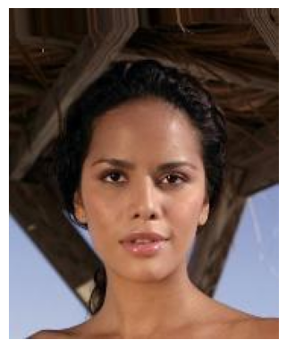
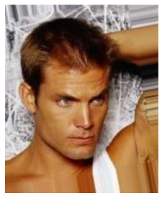
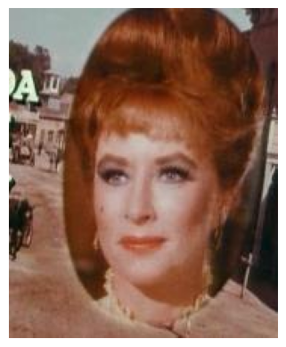
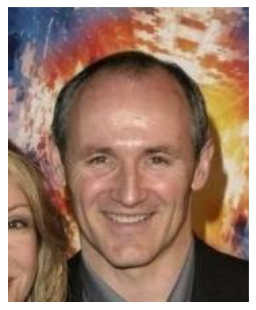
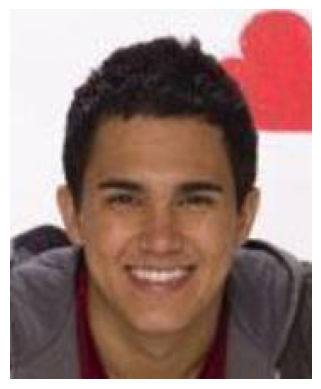
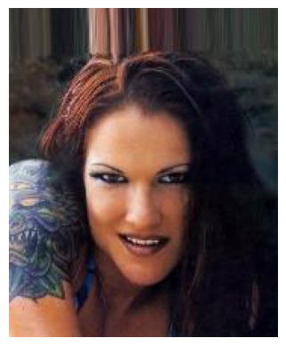

# Starting simple: Autoencoders

Autoencoders are a good place to start since they'll demonstrate why the idea of being able to sample from a distribution is important. The way they work is also pretty intutive. Autoencoders learn low dimensional representations by passing data through a "bottle neck" and try to reconstruct it at the other end. 

## What is an autoencoder?

You can break down an autoencoder network into two parts, the encoder and decoder. The network is trained jointly by passing data through each part and trying to reconstruct the input. In order for this to work The output of the encoder needs to contain enough information about the input data so that the decoder network can recreate it.

**ToDo: autoencoder images**

The encoder output can be considered a low(er) dimensional vector representation of the input data. They're often called latent or hidden vectors since they contain the latent attributes of the data. For our purposes though the most interesting part is the decoder. If you train an autoencoder on a collection of images then you should be able to generate new images by passing simple, low dimensional data into the decoder input!

## Generating iamges

For this example we'll try and generate some faces from the famous [CelebA](https://mmlab.ie.cuhk.edu.hk/projects/CelebA.html) dataset. The dataset contains 

::: {#fig-celeba layout-ncol=3}
{}

{}

{}

{}

{}

{}

Examples from CelebA validation set
:::

Intuitively 

> I remember asking a researcher at my old job exactly why VAEs made the assumption that elements in the latent space were normally distributed and the response was "that's just the assumption of the model. At the time it did not help.

#### References

